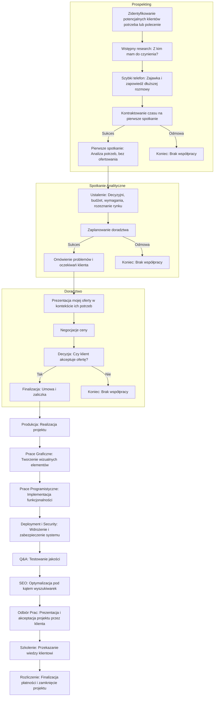

# Plan Systemu Zarządzania Firmą "Luna Design" w WordPress

Poniższy dokument przedstawia plan wdrożenia systemu zarządzania firmą, oparty na WordPress.

```mermaid
flowchart TD
    %% Przykładowa legenda kolorów
    subgraph Legenda
        direction TB
        L1["💡 Klient Kontaktowy"]:::clientContact
        L2["🛠️ Praca Wewnętrzna"]:::internalWork
        L3["🔷 Decyzja"]:::decision
        L4["🏁 Kamień Milowy"]:::milestone
        L5["📂 Faza"]:::phase
        L6["✅ Zakończenie Sukcesem"]:::endSuccess
        L7["❌ Zakończenie Niepowodzeniem"]:::endFail
    end

    %% Definicje Stylów (CSS-like)
    classDef clientContact fill:#e0f7fa,stroke:#00796b,stroke-width:2px,color:#004d40
    classDef internalWork fill:#fff9c4,stroke:#fbc02d,stroke-width:2px,color:#5f4300
    classDef decision fill:#ffcdd2,stroke:#c62828,stroke-width:2px,color:#8e0000,shape:diamond
    classDef milestone fill:#c8e6c9,stroke:#2e7d32,stroke-width:4px,color:#1b5e20
    classDef phase fill:#eceff1,stroke:#37474f,stroke-width:2px
    classDef endSuccess fill:#a5d6a7,stroke:#1b5e20,stroke-width:2px
    classDef endFail fill:#ef9a9a,stroke:#b71c1c,stroke-width:2px
```

```mermaid
flowchart TD
    %% =================================================================
    %% Definicje Stylów (CSS-like)
    %% =================================================================
    classDef clientContact fill:#e0f7fa,stroke:#00796b,stroke-width:2px,color:#004d40
    classDef internalWork fill:#fff9c4,stroke:#fbc02d,stroke-width:2px,color:#5f4300
    classDef decision fill:#ffcdd2,stroke:#c62828,stroke-width:2px,color:#8e0000,shape:diamond
    classDef milestone fill:#c8e6c9,stroke:#2e7d32,stroke-width:4px,color:#1b5e20
    classDef phase fill:#eceff1,stroke:#37474f,stroke-width:2px
    classDef endSuccess fill:#a5d6a7,stroke:#1b5e20,stroke-width:2px
    classDef endFail fill:#ef9a9a,stroke:#b71c1c,stroke-width:2px

    %% =================================================================
    %% Etap 1: Prospekting i Kwalifikacja
    %% =================================================================
    subgraph SG1[ETAP 1: PROSPEKTING]
        direction LR
        A1["💡 Zidentyfikowanie leada<br>(polecenie / marketing / research)"]:::clientContact
        A1_CRM["✍️ Rejestracja leada w systemie CRM"]
        A2["🕵️‍♂️ Wstępny research<br>(Strona WWW, LinkedIn, analiza rynku)"]
        A3["📞 Pierwszy kontakt (Warm Call)<br>Zajawka, badanie bólu, zapowiedź maila"]
        A4["📧 Wysłanie maila<br>Podsumowanie, propozycja spotkania analitycznego"]
        A5{Czy jest zainteresowanie i umówiono spotkanie?}

        A1 --> A1_CRM --> A2 --> A3 --> A4 --> A5
    end

    %% =================================================================
    %% Etap 2: Analiza i Warsztat
    %% =================================================================
    subgraph SG2[ETAP 2: SPOTKANIE ANALITYCZNE]
        B1["🤝 Warsztat analityczny z klientem<br>(głębokie zrozumienie celów biznesowych)"]
        subgraph B2[Kwalifikacja i Zbieranie Wymagań]
            direction TB
            B2_1["B: Określenie budżetu i możliwości finansowych"]
            B2_2["A: Identyfikacja wszystkich decydentów i interesariuszy"]
            B2_3["N: Głębsze zrozumienie potrzeb, problemów i oczekiwanego ROI"]
            B2_4["T: Ustalenie ram czasowych i kluczowych terminów (timeline)"]
        end
        B3["📝 Stworzenie wewnętrznego briefu projektu"]
        B3_Confirm["📄 Wysłanie podsumowania/briefu do klienta<br>w celu potwierdzenia zrozumienia"]
        B4{Czy klient potwierdził brief i jest zakwalifikowany?}

        B1 --> B2 --> B3 --> B3_Confirm --> B4
    end

    %% =================================================================
    %% Etap 3: Doradztwo i Oferta
    %% =================================================================
    subgraph SG3[ETAP 3: DORADZTWO I OFERTOWANIE]
        C1["✍️ Przygotowanie spersonalizowanej oferty<br>i planu rozwiązania problemów"]
        C1_InternalReview["🧐 Wewnętrzna weryfikacja oferty<br>(techniczna, handlowa, projektowa)"]
        C2["🧑‍🏫 Prezentacja oferty<br>Omówienie wartości, ROI, zakresu i harmonogramu"]
        C3["⚖️ Negocjacje<br>(Zakres, cena, terminy, warunki umowy)"]
        C4{Czy warunki zostały zaakceptowane?}
        C5{"Re-negocjacja lub korekta oferty?"}

        C1 --> C1_InternalReview --> C2 --> C3 --> C4
        C4 --"Nie, ale jest pole do rozmów"--> C5
        C5 --"Tak, korygujemy ofertę"--> C1
        C5 --"Nie, brak porozumienia"--> N3
    end

    %% =================================================================
    %% Etap 4: Produkcja i Wdrożenie
    %% =================================================================
    subgraph SG4[ETAP 4: PRODUKCJA I WDROŻENIE]
        direction TB
        D[📜 Finalizacja umowy i odbiór zaliczki]
        
        subgraph SG4_PREPROD[Pre-produkcja i Planowanie]
           D1["🚀 Wewnętrzny Kick-off projektu"]
           D2["📥 Zebranie i weryfikacja materiałów od klienta<br>(treści, grafiki, dostępy)"]
           D3["🗂️ Podzielenie zlecenia na epiki i zadania<br>(tworzenie backlogu w Jira/Asana)"]
           D4["👥 Przydzielenie ról w projekcie<br>(Project Manager, Designer, Developer)"]
           D5["📅 Przygotowanie szczegółowego harmonogramu projektu<br>(kamienie milowe, sprinty, terminy)"]
           D6["✅ Przypisanie zadań do konkretnych pracowników<br>(w narzędziu do zarządzania projektami)"]
           D7["🤝 Kick-off z klientem<br>Omówienie planu, ról i komunikacji"]
           D --> D1 --> D2 --> D3 --> D4 --> D5 --> D6 --> D7
        end

        subgraph SG4_UXUI[Faza Projektowa UX/UI]
            subgraph SG4_UX[Badania i Architektura UX]
                E1["🎨 Zebranie inspiracji i analiza benchmarków<br>(co robi dobrze konkurencja i dlaczego)"]
                E2["🧠 Warsztat UX/Discovery z klientem<br>(persony, ścieżki użytkownika)"]
                E3["🗺️ Stworzenie architektury informacji i User Flow"]
                E4["✒️ Przygotowanie makiet Lo-Fi (wireframes) dla kluczowych widoków"]
                E5{Akceptacja architektury i wireframes przez klienta?}
                E1 --> E2 --> E3 --> E4 --> E5
                E5 --"Wymaga poprawek"--> E3
            end

            subgraph SG4_UI[Design wizualny UI]
                E6["🎨 Stworzenie Moodboardu / Style Tile<br>(kolorystyka, typografia, styl ikon)"]
                E7["🖥️ Projektowanie makiet Hi-Fi (Visual Design)<br>na podstawie zaakceptowanych wireframes"]
                E8["🖱️ Stworzenie interaktywnego prototypu<br>(np. w Figma, Adobe XD)"]
                E9{Akceptacja finalnego designu i prototypu?}
                E6 --> E7 --> E8 --> E9
                E9 --"Wymaga poprawek"--> E7
            end
            E5 --"Zaakceptowano"--> SG4_UI
        end

        subgraph SG4_DEV[Development Iteracyjny]
            DEV_START((Rozpoczęcie Developmentu))
            DEV_PLAN["🗓️ Planowanie Sprintu/Iteracji<br>(wybór zadań z backlogu)"]
            subgraph DEV_SPRINT[Prace programistyczne w Sprincie]
                direction LR
                DEV_BE["👨‍💻 Implementacja API i logiki<br>(Backend)"]
                DEV_FE["💅 Kodowanie interfejsu<br>(Frontend)"]
            end
            DEV_INTEGRATION["🔗 Integracja i budowanie funkcjonalności"]
            DEV_REVIEW["🧐 Weryfikacja kodu (Peer Review)<br>i testy jednostkowe"]
            DEV_INTERNAL_DEMO["Show & Tell<br>Wewnętrzne demo postępów dla zespołu"]
            DEV_CLIENT_DEMO["🕹️ Prezentacja działającej wersji klientowi<br>(Sprint Review)"]
            DEV_ACCEPT{Akceptacja iteracji przez klienta?}
            DEV_CHECK{Czy wszystkie zaplanowane zadania zostały zrealizowane?}

            DEV_START --> DEV_PLAN --> DEV_SPRINT --> DEV_INTEGRATION --> DEV_REVIEW --> DEV_INTERNAL_DEMO --> DEV_CLIENT_DEMO --> DEV_ACCEPT
            DEV_ACCEPT --"Wymaga poprawek do sprintu"--> DEV_PLAN
            DEV_ACCEPT --"Zaakceptowano"--> DEV_CHECK
        end

        subgraph SG4_TEST[Wdrożenie i Testy Końcowe]
           G1["🧪 Deployment na serwer testowy (staging)"]
           G2["🐞 Wewnętrzne, kompleksowe testy Q&A<br>(cross-browser, RWD, wydajność)"]
           G3{Znaleziono krytyczne błędy?}
           G4["👨‍🔬 Testy akceptacyjne klienta (UAT)"]
           G5{Klient zgłasza poprawki?}
           G6["🚀 Deployment na serwer produkcyjny<br>(Go-Live!)"]
           G7["🔐 Konfiguracja finalna<br>(domena, SSL, backupy, monitoring)"]
           
           G1 --> G2 --> G3
           G3 --"Tak, krytyczne"--> DEV_PLAN
           G3 --"Nie"--> G4
           G4 --> G5
           G5 --"Tak, w ramach umowy"--> DEV_PLAN
           G5 --"Nie / nowe zadania"--> G6
           G6 --> G7
        end

        subgraph SG4_FINAL[Finalizacja Projektu]
           H1["📈 Podstawowa optymalizacja SEO On-page"]
           H2["🎓 Szkolenie klienta z obsługi systemu (CMS)"]
           H3["🔑 Przekazanie dostępów i kompletnej dokumentacji technicznej"]
           H4["📡 Monitoring powdrożeniowy<br>(obserwacja stabilności przez 7-14 dni)"]
        end

        D --> SG4_PREPROD --> SG4_UXUI
        E9 --"Zaakceptowano"--> SG4_DEV
        DEV_CHECK --"Tak, koniec prac"--> SG4_TEST
        DEV_CHECK --"Nie, kolejny sprint"--> DEV_PLAN
        G7 --> SG4_FINAL
    end
    
    %% =================================================================
    %% Etap 5: Zakończenie i Rozliczenie
    %% =================================================================
    subgraph SG5[ETAP 5: ZAKOŃCZENIE I ROZLICZENIE]
        I1["✅ Protokół odbioru końcowego prac"]
        I2["💰 Wystawienie faktury końcowej"]
        I3["💸 Otrzymanie płatności i zamknięcie projektu w systemie"]
        I4["⭐ Prośba o referencje / przygotowanie Case Study"]
        I5["📋 Przekazanie klienta do działu utrzymania/wsparcia<br>(opcjonalnie)"]
    end

    %% =================================================================
    %% Połączenia Głównej Ścieżki i Ścieżek Negatywnych
    %% =================================================================
    START((Start)) --> SG1
    A5 --"Tak"--> SG2
    A5 --"Nie"--> N1[Koniec: Brak współpracy]
    B4 --"Tak"--> SG3
    B4 --"Nie"--> N2[Koniec: Klient niezakwalifikowany]
    C4 --"Tak"--> SG4
    C4 --"Nie, koniec rozmów"--> N3[Koniec: Brak akceptacji oferty]
    SG4 --> SG5
    SG5 --> END((Zakończenie Sukcesem))
    
    %% =================================================================
    %% Interaktywność (przykłady)
    %% =================================================================
    click C1 "#" "Pobierz szablon oferty"
    click D "#" "Pobierz wzór umowy"
    click I1 "#" "Pobierz wzór protokołu odbioru"
    click H3 "#" "Przejdź do repozytorium dokumentacji"

    %% =================================================================
    %% Aplikowanie stylów do węzłów
    %% =================================================================
    class A3,A4,B1,B3_Confirm,C2,C3,D7,E2,E5,E9,G4,I1,I4 clientContact
    class A1,A1_CRM,A2,B3,C1,C1_InternalReview,D,D1,D2,D3,D4,D5,D6,E1,E3,E4,E6,E7,E8,DEV_PLAN,DEV_BE,DEV_FE,DEV_INTEGRATION,DEV_REVIEW,DEV_INTERNAL_DEMO,G1,G2,G6,G7,H1,H2,H3,H4,I2,I3,I5 internalWork
    class A5,B4,C4,C5,E5,E9,DEV_ACCEPT,DEV_CHECK,G3,G5 decision
    class D,I1,I3 milestone
    class SG4_PREPROD,SG4_UXUI,SG4_DEV,SG4_TEST,SG4_FINAL phase
    class N1,N2,N3 endFail
    class END endSuccess
```

**Zadania do zrobienia**
- [ ] Podłączenie skrzynek mailowych do systemu CRM
- [ ] Stworzenie szablonów e-maili do etapu prospektingu, których ostateczna forma będzie generowana z AI na podstawie danych z CRM i szablonu
    - [ ] Szablon pierwszego kontaktu (powiniem Prospekter dodawać 3 argumenty do kontaktu, które będą użyte w szablonie) 

**Wąskie gardło** 
1. Chciałbym wiedzieć na koniec dnia nad czym ludzie dzisiaj pracowali i ile łącznie godzin. 
2. Chciałbym mieć możliwość szybkiego sprawdzenia, kto ile godzin zaplanował sobie że przepracuje w tym i kolejnym tygodniu oraz w całym miesiącu oraz ile godzin już przepracował w tych okresach. 
3. Chciałbym widzieć w CRMie na widokach osób i firm obecne i zamknięte zlecenia i z tego poziomu wejść na widok szczegółów zlecenia i tam zobaczyć ile kto godzin przepracował w danym zleceniu. Chciałbym też widzieć jakie mamy już zużycie budżetu w danym zleceniu i ile zostało do wykorzystania (jeśli był limit) w taki sposób aby każdy pracownik miał w swoich szczegółach konta jaki jest jego całkowity koszt pracodawcy na godzinę przy uwzględnieniu jego formy zatrudnienia i estymacji ile chce przerpacować godzin w danym miesiącu.

# Opisy poszczególnych kart procesu

## Etap 1: Prospekting

### 1.1 Zidentyfikowanie leada (polecenie / marketing / research)
Zidentyfikowanie potencjalnych klientów na podstawie dostępnych danych, takich jak polecenia, działania marketingowe czy badania rynku.

W systemie CRM należy umieścić widok, który pozwoli osobie z rolą "Prospekter" na łatwe dodawanie nowych leadów. 

Co robi osoba, która zaczyna pracę nad znajnowaniem leadów:
1. Musi zdecydować jakie kryteria będzie stosować do wyszukiwania leadów np. branża, lokalizacja, wielkość firmy.
2. Musi określić, czy będzie korzystać z narzędzi do automatyzacji (np. LinkedIn Sales Navigator, Apollo) czy będzie to manualne wyszukiwanie.
3. Powinna mieć dostęp do bazy danych potencjalnych klientów, np. zebranych z poprzednich działań marketingowych lub poleceń.

-----------------------

## 1. Architektura Danych

Podstawą systemu będzie zestaw niestandardowych typów treści (CPT). Do ich stworzenia zaleca się użycie **Advanced Custom Fields (ACF) Pro** lub **Meta Box**.

### CPT: Firmy (`company`)
Reprezentuje podmiot gospodarczy.
- **Pola Własne:** Nazwa firmy, NIP, REGON, Adres, Wielkość firmy (np. liczba pracowników, przychód roczny).
- **Taksonomie:** `Status` (Potencjalny, Aktywny Klient, Były Klient, Archiwalny) - *status zarządzany częściowo automatycznie*, `Typ Firmy` (Sp. z o.o., JDG, etc.), `Branża` (np. IT, Budownictwo, Handel).
- **Relacje:** 1 Firma -> wiele `Osób` (pracownicy/kontakty), wiele `Szans Sprzedaży`, `Ofert`, `Umów`, `Zleceń`, `Faktur`, `Aktywności`.
- **Widoki:**
    - `Wszyscy`: Domyślna lista firm.
    - `Aktywni Klienci`: Filtrowanie po statusie "Aktywny Klient".
    - `Potencjalni`: Filtrowanie po statusie "Potencjalny".
    - `Archiwalni`: Ukryty widok zarchiwizowanych firm.
    - `Branże`: Widok grupujący firmy według branży.
    - `Klienci Krajowi`: Filtrowanie firm z adresem w Polsce.
    - `Klienci Zagraniczni`: Filtrowanie firm z adresem poza Polską.
- **Akcje:**
    - `Dodaj Osobę`: Szybkie tworzenie i powiązanie osoby kontaktowej.
    - `Dodaj Szansę Sprzedaży`: Tworzenie nowej szansy powiązanej z firmą.
    - `Dodaj Aktywność`: Rejestracja nowej interakcji (telefon, e-mail, notatka).
---

### CPT: Osoby (`person`)
Reprezentuje osobę fizyczną – kontakt, pracownika klienta.
- **Pola Własne:** Imię i nazwisko, Stanowisko, E-mail, Telefon.
- **Relacje:** 1 Osoba -> wiele `Firm` (powiązanie pracownik-firma), wiele `Szans Sprzedaży`, `Ofert`, `Zleceń` (jako główny kontakt).
- **Widoki:**
    - `Wszystkie Osoby`: Lista wszystkich kontaktów.
    - `Kontakty bez Firmy`: Osoby niepowiązane z żadną firmą.
- **Akcje:**
    - `Powiąż z Firmą`: Przypisanie osoby do istniejącej firmy.
    - `Dodaj Aktywność`: Rejestracja interakcji z tą osobą.

---

### CPT: Aktywności (`activity`)
Zastępuje pole "Notatki" i tworzy centralny strumień historii kontaktów.
- **Pola Własne:** Opis, Data i godzina.
- **Taksonomie:** `Typ Aktywności` (Notatka, E-mail, Telefon, Spotkanie).
- **Relacje:** 1 Aktywność -> 1 `Pracownik` (autor), oraz powiązanie z jednym lub wieloma innymi obiektami (`Firma`, `Osoba`, `Szansa Sprzedaży`, `Zlecenie`).
- **Logika:** Aktywność dodana np. do `Szansy Sprzedaży` będzie automatycznie widoczna na osi czasu powiązanej `Firmy` i `Osoby`.

---

### CPT: Szanse Sprzedaży (`lead`)
- **Pola Własne:** Nazwa szansy, Wartość szacowana (PLN), Prawdopodobieństwo (%).
- **Taksonomie:** `Status Szansy` (Nowa, W kwalifikacji, Oferta wysłana, Negocjacje, Wygrana, Przegrana), `Źródło Szansy` (Polecenie, Formularz WWW, Telefon).
- **Relacje:** 1 Szansa -> 1 `Firma` i/lub 1 `Osoba` (kontakt), 1 `Pracownik` (opiekun), wiele `Aktywności`.
- **Akcje:**
    - `Konwertuj na Ofertę`: Tworzy nową ofertę z danymi z szansy.
    - `Dodaj Aktywność`: Szybkie dodanie wpisu do historii kontaktu.

---

### CPT: Oferty (`quote`)
- **Pola Własne:** Numer oferty (auto), Data wystawienia/ważności, Pozycje oferty (repeater), Sumy (auto), Plik PDF.
- **Taksonomie:** `Status Oferty` (Szkic, Wysłana, Zaakceptowana, Odrzucona).
- **Relacje:** 1 Oferta -> 1 `Firma`/`Osoba`, 1 `Szansa Sprzedaży`.
- **Akcje:**
    - `Konwertuj na Zlecenie`: Tworzy wersję roboczą zlecenia.
    - `Duplikuj`: Tworzenie kopii oferty.

---

### CPT: Umowy (`contract`)
- **Pola Własne:** Numer umowy, Data zawarcia/obowiązywania, Skan/plik PDF.
- **Taksonomie:** `Status Umowy` (W przygotowaniu, Aktywna, Zakończona).
- **Relacje:** 1 Umowa -> 1 `Firma`/`Osoba`, wiele `Zleceń`.

---

### CPT: Zlecenia (`project`)
- **Pola Własne:** Nazwa zlecenia, Budżet (PLN), Termin rozpoczęcia/zakończenia.
- **Taksonomie:** `Status Zlecenia` (Planowane, W toku, Zakończone), `Typ Zlecenia` (Strona WWW, SEO).
- **Relacje:** 1 Zlecenie -> 1 `Firma`/`Osoba`, 1 `Umowa`, wiele `Pracowników`, `Zadań`, `Wpisów Czasowych`, `Faktur`, `Transakcji`, `Aktywności`.

---

### CPT: Zadania (`task`)
- **Pola Własne:** Nazwa zadania, Estymowany czas (h), Termin wykonania.
- **Taksonomie:** `Status Zadania` (Do zrobienia, W toku, Do weryfikacji, Zrobione), `Priorytet`.
- **Relacje:** 1 Zadanie -> 1 `Zlecenie`, 1 `Pracownik`.

---

### CPT: Wpisy Czasowe (`time_entry`)
- **Pola Własne:** Data, Ilość czasu (h), Opis czynności.
- **Relacje:** 1 Wpis -> 1 `Pracownik`, 1 `Zlecenie`, opcjonalnie 1 `Zadanie`.

---

### CPT: Faktury (`invoice`)
- **Rekomendacja:** Integracja z zewnętrznym API (np. Fakturownia, inFakt). Tworzenie własnego, w pełni zgodnego z prawem systemu fakturowania jest ogromnym i niepotrzebnym wysiłkiem.
- **Pola Własne:** Numer (z API), Daty, Kwoty, Link do PDF.
- **Taksonomie:** `Status Faktury` (Do wystawienia, Wysłana, Opłacona, Po terminie).
- **Relacje:** 1 Faktura -> 1 `Firma`/`Osoba`, 1 `Zlecenie`, wiele `Transakcji`.

---

### CPT: Konta Finansowe (`financial_account`)
- Reprezentuje rachunek bankowy, portfel gotówkowy lub inne źródło środków (np. Revolut).
- **Pola Własne:** Nazwa konta, Numer konta/identyfikator, Waluta, Saldo początkowe. *Saldo bieżące będzie obliczane automatycznie na podstawie powiązanych transakcji.*
- **Taksonomie:** `Typ Konta` (Bank, Gotówka, Karta, Inwestycja).
- **Relacje:** 1 Konto -> wiele `Transakcji`.
- **Widoki:** Lista kont z bieżącym saldem.

---

### CPT: Transakcje Finansowe (`transaction`)
- Zastępuje `Płatności Przychodzące` i `Wydatki`. Centralny rejestr wszystkich operacji finansowych.
- **Pola Własne:** Tytuł/Opis, Data, Kwota (dodatnia dla przychodów, ujemna dla wydatków), Skan/plik dokumentu.
- **Taksonomie:** `Typ Transakcji` (Przychód, Wydatek, Przelew wewnętrzny), `Kategoria` (np. Sprzedaż usług, Wynagrodzenia, Hosting, Podatki), `Status` (Zaksięgowana, Oczekująca).
- **Relacje:** 1 Transakcja -> 1 `Konto Finansowe`, opcjonalnie 1 `Firma`/`Osoba`, opcjonalnie 1 lub wiele `Faktur` (dla przychodów), opcjonalnie 1 `Zlecenie` (dla kosztów projektowych).
- **Logika:**
    - Dodanie transakcji automatycznie aktualizuje saldo powiązanego `Konta Finansowego`.
    - Powiązanie transakcji typu "Przychód" z `Fakturą` może automatycznie zmieniać jej status na "Opłacona".

---

### CPT: Pracownicy (`employee`)
- **Pola Własne:** Stanowisko, Stawka godzinowa (PLN).
- **Relacje:** 1 Pracownik -> 1 `Użytkownik` WordPress.

## 2. Role Użytkowników i Uprawnienia

| Rola              | Opis                                                                 | Dostęp (CRUD - Create, Read, Update, Delete)                                                                 |
|--------------------|----------------------------------------------------------------------|------------------------------------------------------------------------|
| **Administrator**  | Pełen dostęp do wszystkich danych i ustawień.                        | **CRUD** na wszystkich CPT.                                           |
| **Project Manager**| Zarządza przypisanymi zleceniami, zespołem i budżetem.               | **CRUD** na `Zleceniach`, `Zadaniach`, `Wpisach Czasowych` w ramach swoich projektów. **Create/Read** na `Transakcjach` (kosztowych). **Read** na `Firmach`, `Osobach`, `Ofertach`, `Umowach`. |
| **Pracownik**      | Realizuje zadania i raportuje czas pracy.                            | **Update** na własnych `Zadaniach`. **CRUD** na własnych `Wpisach Czasowych`. **Read** na `Zleceniach` i `Zadaniach`, do których jest przypisany. |
| **Handlowiec**     | Odpowiada za proces sprzedaży.                                       | **CRUD** na `Firmach`, `Osobach`, `Szansach Sprzedaży` i `Ofertach`. **CRUD** na `Aktywnościach` powiązanych ze sprzedażą. |
| **Księgowość**     | Zarządza finansami.                                                  | **CRUD** na `Fakturach`, `Transakcjach Finansowych`, `Kontach Finansowych`. **Read** na `Firmach`, `Osobach` i `Umowach`. |
| **Klient**         | Dostęp do portalu klienta (front-end). Użytkownik powiązany z `Firmą` lub `Osobą`. | **Read** na własnych `Zleceniach`, `Ofertach`, `Fakturach`. Możliwość dodawania komentarzy/`Aktywności`. |

## 3. Kluczowe Funkcjonalności, Widoki i Automatyzacje

### A. Dashboardy Główne
Spersonalizowane pulpity dla każdej roli z kluczowymi informacjami.

### B. Automatyzacja Przepływu Pracy
- **Status Klienta:**
    - `Firma`/`Osoba` staje się **"Aktywnym Klientem"**, gdy powiązane `Zlecenie` przechodzi w status "W toku".
    - `Firma`/`Osoba` staje się **"Byłym Klientem"**, gdy ostatnie aktywne `Zlecenie` zostaje "Zakończone".
- **Oferta Zaakceptowana:** Automatyczne tworzenie wersji roboczej `Zlecenia`.
- **Transakcja Zaksięgowana:** Powiązanie `Transakcji` typu 'Przychód' z `Fakturą` automatycznie zmienia jej status na 'Opłacona'.
- **Zadanie po Terminie:** Automatyczne powiadomienie pracownika i Project Managera.

### C. Raportowanie i Analizy
- **Raport Rentowności Zleceń:** Przychody (z powiązanych `Faktur`) - Koszty (czas pracy + `Transakcje` wydatkowe).
- **Raport Sprzedażowy:** Konwersja lejka, wartość szans, sprzedaż wg źródła.
- **Raport Finansowy:** Przepływy pieniężne (cashflow) per `Konto Finansowe`, raporty wydatków/przychodów wg kategorii, lista nieopłaconych faktur.
- **Strategia:** Aby uniknąć problemów z wydajnością, rozważone zostanie buforowanie (keszowanie) raportów. Mogą być one generowane cyklicznie (np. co noc przez WP-Cron) i zapisywane jako gotowe dane, co zapewni błyskawiczny dostęp dla użytkownika.

### D. Portal Klienta (Front-End)
- Bezpieczny dostęp do strefy klienta.
- Widok zleceń, faktur, ofert.
- System komunikacji (oparty o CPT `Aktywności`).

### E. Powiadomienia Systemowe (E-mail / WP-Admin)
- O przypisaniu zadania, zbliżającym się terminie, nowej aktywności od klienta, zmianie statusu zlecenia.

### F. Usprawnienia Interfejsu
- **Wyszukiwarka Globalna:** Przeszukiwanie wszystkich CPT.
- **Widoki Relacji i Aktywności:** Na stronie edycji `Firmy` zakładki z listą powiązanych `Osób`, `Zleceń`, `Faktur` oraz **oś czasu ze wszystkimi `Aktywnościami`**.
- **Rejestracja Czasu:** Stoper uruchamiany bezpośrednio z widoku `Zadania`.
- **Import Transakcji:** Dedykowany interfejs do importowania wyciągów bankowych. **Uwaga:** Implementacja jest złożona; w pierwszej kolejności należy skupić się na dobrze zdefiniowanym formacie CSV, a obsługę standardów jak MT940 rozważyć w dalszym etapie.

## 4. Przykładowy Przepływ Pracy
1. **Zapytanie:** Nowe zapytanie -> `Handlowiec` tworzy w systemie `Firmę` i/lub `Osobę` kontaktową. Następnie tworzy `Szansę Sprzedaży` i powiązuje ją z nimi. Wszelkie ustalenia zapisuje jako `Aktywności` (np. typu "Telefon").
2. **Oferta:** `Handlowiec` przygotowuje i wysyła `Ofertę`.
3. **Akceptacja:** Klient akceptuje -> Status `Oferty` zmieniony na "Zaakceptowana". **Automatycznie** tworzona jest wersja robocza `Zlecenia`.
4. **Projekt:** `Project Manager` uzupełnia dane `Zlecenia`. **Automatycznie** status `Firmy`/`Osoby` zmienia się na "Aktywny Klient".
5. **Realizacja:** `Pracownicy` realizują `Zadania` i rejestrują `Wpisy Czasowe`. `Księgowość` lub `PM` rejestrują koszty związane z projektem jako `Transakcje` typu 'Wydatek', powiązując je ze `Zleceniem`.
6. **Fakturowanie:** `Księgowość` generuje `Fakturę`.
7. **Płatność:** `Księgowość` rejestruje wpływ na konto jako `Transakcję` typu 'Przychód' na odpowiednim `Koncie Finansowym` i powiązuje ją z `Fakturą`.
8. **Zamknięcie:** Zmiana statusu `Zlecenia` na "Zakończone". Jeśli to ostatni aktywny projekt, **automatycznie** status `Firmy`/`Osoby` zmienia się na "Były Klient".

## 5. Rekomendacje Technologiczne
- **Pola i CPT:** Advanced Custom Fields (ACF) Pro / Meta Box.
- **Uprawnienia:** Members / User Role Editor.
- **Formularze (Portal Klienta):** Gravity Forms / Fluent Forms.
- **Raporty i Widoki:** Samodzielne tworzenie stron admina lub użycie wtyczek jak WP Data Access.
- **Wysyłka E-maili:** Fluent SMTP (dla niezawodności dostarczania powiadomień).
- **Testowanie:** PHPUnit i WP-CLI do tworzenia testów automatycznych w celu zapewnienia stabilności systemu.

## 6. Strategiczne Założenia, Ryzyka i Sugestie Rozwoju

Ta sekcja uzupełnia plan o kluczowe aspekty strategiczne i techniczne, które są niezbędne dla długoterminowego sukcesu i skalowalności projektu.

### A. Wydajność i Skalowalność
- **Ryzyko:** Przy dużej liczbie CPT, relacji i pól (ACF/Meta Box przechowuje dane w `wp_postmeta`), system może stać się powolny, gdy zgromadzi się w nim dużo danych. Złożone zapytania filtrujące (np. raporty rentowności) mogą bardzo obciążać bazę danych.
- **Strategia:**
    - **Optymalizacja od początku:** Unikanie skomplikowanych `meta_query` tam, gdzie to możliwe.
    - **Dedykowane tabele:** W przyszłości, w przypadku spowolnień, należy rozważyć przeniesienie krytycznych danych (np. analitycznych, finansowych) do dedykowanych, niestandardowych tabel w bazie danych, co drastycznie przyspieszy ich przetwarzanie.

### B. Interfejs Użytkownika (UI/UX)
- **Ryzyko:** Domyślny interfejs WordPressa może być niewygodny i nieintuicyjny dla tak złożonego systemu. Przełączanie się między wieloma powiązanymi postami może być frustrujące i obniżać efektywność.
- **Strategia:**
    - **Niestandardowe widoki:** Zaplanowanie znaczących inwestycji w customizację panelu admina. Zamiast polegać na standardowych widokach CPT, należy stworzyć dedykowane strony administracyjne (np. z użyciem `add_menu_page`), które będą prezentować dane w bardziej przejrzysty sposób (np. dashboard klienta z listą jego zleceń, faktur i osią czasu aktywności na jednym ekranie).
    - **Nowoczesny front-end:** Rozważenie użycia bibliotek JS (np. React, Vue) komunikujących się przez REST API do budowy dynamicznych i interaktywnych interfejsów w panelu admina.

### C. Podejście "API-First"
- **Strategia:** Projektowanie systemu tak, aby wszystkie dane i akcje były dostępne przez WordPress REST API. Zapewni to, że panel admina będzie tylko jednym z klientów API, co otworzy drogę do stworzenia w przyszłości np. dedykowanej aplikacji mobilnej lub zaawansowanego portalu klienta.

### D. Bezpieczeństwo
- **Strategia:** Oprócz ról użytkowników, należy wdrożyć dodatkowe warstwy zabezpieczeń:
    - **Walidacja i sanityzacja:** Rygorystyczna weryfikacja wszystkich danych wprowadzanych przez użytkownika po stronie serwera.
    - **Zabezpieczenie API:** Ochrona wszystkich endpointów REST API za pomocą odpowiednich sprawdzeń uprawnień (`permission_callback`).
    - **Regularne audyty:** Planowanie okresowych audytów bezpieczeństwa kodu i infrastruktury.
